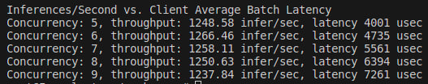
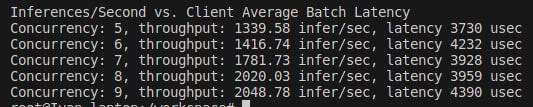

# Appartment Prices Prediction

This is an educational project within the MIPT MLOps course.

There is a data set about apartments in the city of Seattle, Washington. The task is to predict the price of housing according to the available data.
The data has the following columns:
* id — housing identification number
* date — date of sale of the house
* price — price
* bedrooms — number of bedrooms
* bathrooms — the number of bathrooms where .5 means a room with a toilet, but without a shower
* sqft_living — housing area
* sqft_lot — plot area
* floors — number of floors
* waterfront — is the embankment visible
* view — how good is the view
* condition — index from 1 to 5, responsible for the condition of the apartment
* grade — 1 to 13, 1-3 corresponds to a poor level of construction and design, 3-7 — medium level, 11-13 — high.
* sqft_above — living area above ground level
* sqft_basement — living area below ground level
* yr_built — year of housing construction
* yr_renovated — the year of the last housing renovation
* zipcode — zip code
* lat — latitude
* long — longitude

# CLI

```
poetry intsall
# train model and save it
poetry run python3 ./apartment_prices_prediction/train.py

# evaluate model on vaidation data
poetry run python3 ./apartment_prices_prediction/infer.py
```

## make server with mlflow models

```
bash run_server.sh
```
note that you have virtualenv to be installed. Also check model name/stage/uri before you start the script

## request to server
```
curl -d '{"dataframe_split": {
"columns": ["Unnamed: 0","id","date","price","bedrooms","bathrooms","sqft_living","sqft_lot","floors","waterfront","view","condition","grade","sqft_above","sqft_basement","yr_built","yr_renovated","zipcode","lat","long","sqft_living15","sqft_lot15"],
"data": [[1,18295,"20151209T000000",538000.0,3,2.25,2570,7242,2.0,0,0,3,7,2170,400,1951,1991,98125,47.721,-122.319,1690,7639]]}}' \
-H 'Content-Type: application/json' -X POST localhost:8001/invocations
```

# Task3 (Triton server)

1. Системная конфигурация:
* OS: Ubuntu 20.04.6 LTS
* CPU: Intel(R) Core(TM) i5-8250U CPU @ 1.60GHz
* Кол-во vCPU: 4
* RAM: 8GM

2. Структура model_repository
```
├── client.py
├── docker-compose.yaml
├── Dockerfile
├── model_repository
│   └── catboost
│       ├── 1
│       │   ├── model.py
│       └── config.pbtxt
└── requirements.txt
```

3. Оптимизация throughput и latency.

До оптимизаций:  


После оптимизаци (max_queue_delay_microseconds: 100, cpu: 2)


Мотивация такая: если менять параметры, то метрики throughpu и latency улучшаются. Вот я и поменял

### Запуск клиента

```
conda config --add channels conda-forge
conda create -n tritonclient tritonclient-http
conda activate tritonclient
python client.py
```
